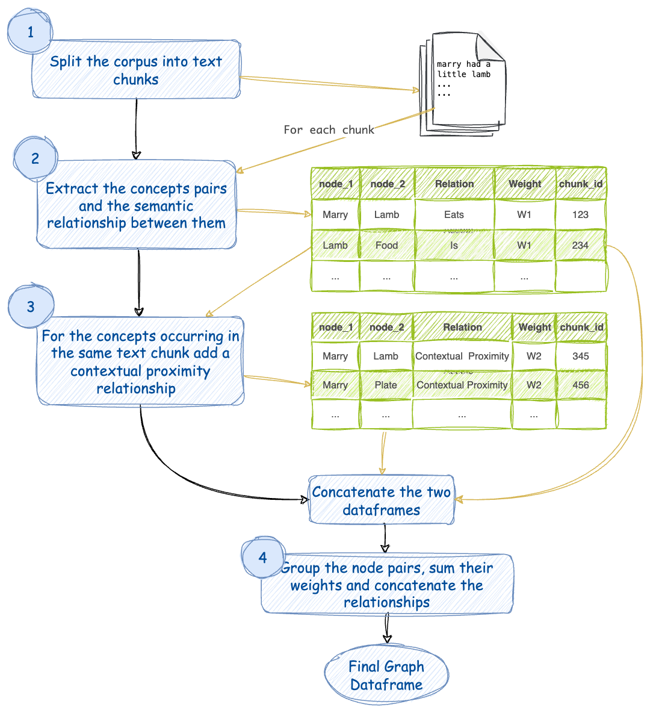

# 将任何文本语料库转换为*知识图谱*


*使用此代码生成的知识图谱* 
此图的ghpages链接: https://rahulnyk.github.io/knowledge_graph/

## 快速使用

- [安装 poetry](https://python-poetry.org/docs/)
- 安装基础环境
```bash
conda env create -f environment.yml
```
- 使用 poetry 安装依赖包
```bash
poetry install
```
- 进入 ./extract_graph.ipynb 文件进行图谱生成

## 什么是知识图谱？
知识图谱，也称为语义网络，表示了现实世界实体的网络，即对象、事件、情况或概念，并展示它们之间的关系。这些信息通常存储在图数据库中，并以图结构可视化，因此有了知识“图”这个术语。

来源: https://www.ibm.com/topics/knowledge-graph

## 如何从一篇作品中创建一个简单的知识图谱？
1. 清理文本语料库（作品）。
2. 从文本语料库中提取概念和实体。
3. 提取实体之间的关系。 
4. 转换为图模式。 
5. 填充节点（概念）和边缘（关系）。
6. 可视化和查询。 

第6步是纯粹可选的，但与之相关的某种艺术满足感。网络图是美丽的对象（只需看上面的横幅图像，是不是很美？）。幸运的是，有许多Python库可用于生成图形可视化。

## 为什么使用知识图谱？
一旦建立了知识图谱（KG），我们可以用它来实现许多目的。我们可以运行图算法并计算任何节点的中心性，以了解一个概念（节点）对这个作品的重要性。我们可以计算社区以将概念聚集在一起，以更好地分析文本。我们可以理解看似不相关概念之间的联系。

最重要的是，我们可以通过使用图作为检索器以更深入的方式与文本交谈，实现**图检索增强生成（GRAG）**。这是**检索增强生成（RAG）**的新版本，其中我们使用矢量数据库作为检索器与文档交谈。

---

## 本项目
在这里，我从一个PDF文档中创建了一个简单的知识图谱。我在这里遵循的流程与上述部分概述的非常相似，但做了一些简化。

首先，我将整个文本分成块。然后，我使用LLM从每个块中提取提到的概念。请注意，我在这里不使用NER模型提取实体。概念和实体之间有区别。例如，“Bangalore”是一个实体，“Bangalore的宜人天气”是一个概念。根据我的经验，概念比实体更有意义。

我假设在彼此附近提到的概念是相关的。因此，KG中的每条边都是提到这两个连接概念的文本块。

一旦计算出节点（概念）和边缘（文本块），使用这里提到的库将它们很容易地创建成图形。
我在这里采用了无GPT的方法，以保持经济性。我使用了出色的Mistral 7B openorca指令，这个模型非常适合这个用例。该模型可以使用Ollama在本地设置，因此生成KG基本上是免费的（不需要调用GPT）。

要生成图形，您需要调整此笔记本。

**[extract_graph.ipynb](https://github.com/rahulnyk/knowledge_graph/blob/main/extract_graph.ipynb)**

该笔记本实现了以下流程图中概述的方法。



1. 将文本语料库分成块。为每个块分配一个块ID。
2. 对于每个文本块，使用LLM提取概念及其语义关系。让我们将这种关系赋予权重W1。同一对概念之间可能存在多个关系。每个关系都是一对概念之间的边。
3. 考虑出现在同一文本块中的概念也是通过其上下文接近相关的。让我们将这种关系赋予权重W2。请注意，同一对概念可能出现在多个块中。
4. 将相似的对组合在一起，对它们的权重求和，并连接它们的关系。因此，现在在任何不同对的概念之间只有一条边。该边具有一定的权重和一系列关系作为其名称。

此外，它还计算每个节点的度和节点的社区，以分别调整和着色图中的节点。

**[这里有一篇详细解释该方法的Medium文章](https://medium.com/towards-data-science/how-to-convert-any-text-into-a-graph-of-concepts-110844f22a1a)**


---
## 技术栈

### Mistral 7B
<a href="https://mistral.ai/news/announcing-mistral-7b/"></a>

我正在使用[Mistral 7B Openorca](https://huggingface.co/Open-Orca/Mistral-7B-OpenOrca)来从文本块中提取概念。它能很好地遵循系统提示指令。

### Ollama
<a href="https://ollama.ai"></a>

Ollama使得在本地主机上托管任何模型变得简单。Mistral 7B OpenOrca版本已经与Ollama一起提供，可立即使用。

要设置此项目，您必须在本地计算机上安装Ollama。

步骤1：安装Ollama https://ollama.ai

步骤2：在终端中运行 `ollama run zephyr`。这将从服务器上拉取zephyr模型到您的本地计算机，并启动Ollama服务器。

### Pandas 
用于图模式的数据框架（可以在以后阶段使用图数据库）。

### NetworkX 
<a href="https://networkx.org"><a/>

这是一个使处理图形变得非常容易的Python库。

### Pyvis
[Pyvis Python库](https://github.com/WestHealth/pyvis/tree/master)用于可视化。Pyvis使用Python生成JavaScript图形可视化，因此最终的图形可以在Web上托管。例如，此存储库的[GitHub链接](https://rahulnyk.github.io/knowledge_graph/)是由pyvis生成的图形。


### 后端

- [ ] 使用嵌入来去重语义上相似的概念（**由William Claude在[Medium文章](https://medium.com/towards-data-science/how-to-convert-any-text-into-a-graph-of-concepts-110844f22a1a)中建议**）
    - [ ] 避免LLM写入不同的相似概念（例如：“医生”和“医生”）
    - [ ] 加强强烈相似概念的聚类（例如：“医生”和“医疗从业者”）？

- [ ] 过滤掉可能对理解文本没有用的冗余或异常概念。例如，文本中经常出现的通用概念。 （**由Luke Chesley建议**）

- [ ] 更好地实现上下文接近的概念，避免过度强调出现频率过高的某些概念，或清除无用的边缘。 （**由Luke Chesley建议**）

### 前端
- [ ] 创建一个前端，以更有用的方式呈现概念图。例如，这里是一个流程。 （**由David Garcia在[Medium文章](https://medium.com/towards-data-science/how-to-convert-any-text-into-a-graph-of-concepts-110844f22a1a)中建议**）。
    1. 提供概念/兴趣/主题列表
    2. 用户选择感兴趣的内容
    3. 展开显示子主题、子概念、子-x等。
    4. 这是如何深入专业领域的。
